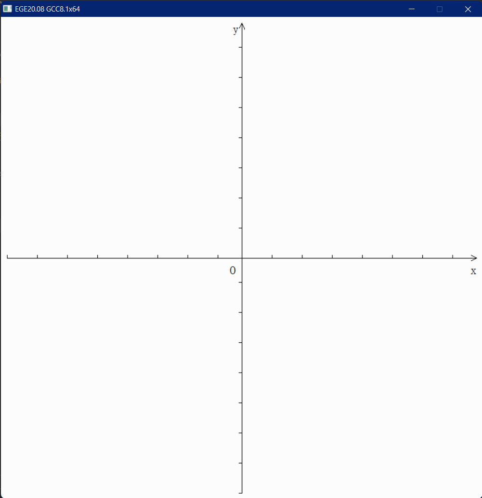

# RKCG

计算机图形学课程的相关实践

## 前言

- 计算机图形学的理论课程虽没有怎么听，但对实验课程的相关内容还是饶有兴趣的。

- 由于主机上的MFC框架搭在VS2017上，VS2017的重量级自不必说:dizzy_face:，更重要的是其自带的那套快捷键简直和我相生相克:sob:，于是就只好折腾vscode上的计算机图形学了:punch::punch:

  * 图形库这块我选择了[EGE](https://github.com/wysaid/xege)
  * 本以为就是配个`include`，没想到还涉及很多问题【~~哎，头发怎么又变稀了？？
    ~~】，当然收获也颇为丰厚！关于总结可以戳这个[:point_up_2:](https://crazyokd.github.io/2021/10/10/%E8%A7%A3%E5%86%B3vscode%E5%BC%95%E7%94%A8c++%E5%A4%96%E9%83%A8%E5%BA%93%E6%8A%A5%E9%94%99/)

## 快速开始

试试这行命令：

```bat
.\test.bat example
```

不出意外的话，你会看到一个带有简单坐标系的窗口，实际上这行命令会编译 [example.cpp](example.cpp) 并执行，你可以通过编辑该文件来绘制你自己的图形。



## 项目进度

- 使用 _DDA算法/中点画线法_ 实现直线绘制。
    * 由于我完全不会Bresenham算法[~~别怀疑，上课很认真！~~],所以仅实现了DDA算法和中点画线法，尤其集中在中点画线法上。
    * 使用中点画线法时，不同的斜率范围也对应着不同的递推公式，所以实现起来也没那么顺手，特别是我这种数学菜鸡。:cry:
- 使用中点算法实现了圆和椭圆的绘制（中点算法yyds）。
    * 在此过程中出于必要又封装了一个`putpixelRK`方法。
- 实现了扫描转换多边形。

    * 其实没有必要非要使用链表，但这种数据结构玩起来非常有意思（~~虽然容易爆空指针、段异常~~）。
- 更新了区域填充算法，包括递归填充（四连通）和扫描线填充。
- 更新了直线剪裁算法，包括**Cohen-Sutherland算法**和**梁友栋-Barsky算法**
- `rkcg.h`和`next_rkcg.h`待合并...

## 目录结构

- [examples/](examples/)

    包含了一些配置文件的例子，比如 [.vscode/](examples/.vscode/)，在不同的计算机上配置一般不同（比如编译器路径），所以这里的文件仅作参考，你可以在你的项目根目录新建一个 `.vscode` 文件夹，将[该文件夹](examples/.vscode/)内的文件复制进去，再根据自己的环境适当更改。
    
- [include/](include/)
  
    编写相关程序时经常要使用到的头文件。
    
- [lib/](lib/)

    程序编译链接时必须要使用到的依赖。

## 如何运行

1. 使用 VS Code 调试

    使用该方法可以在 VS Code 里按 F5 运行调试任意源文件，首先你需要如上所属配置好 `.vscode` 文件夹，再打开你写的源文件，比如 [hello.cpp](hello.cpp)，然后按 F5 即可运行。

2. 使用命令行编译

    写了一个简易的脚本 [make.bat](make.bat) 来模仿 `make` 的功能，使用方式是：

    ```bat
    .\make.bat <fileBasenameNoExtension>
    ```

    唯一并且唯一的参数是去掉扩展后的源文件名，比如 `hello.cpp` 对应的就是 `hello`。

    还有一个类似的测试脚本 [test.bat](test.bat)，每次都会调用 [make.bat](make.bat) 重新生成程序并运行，~~免去了调试的时间损耗~~。

## 参考

- [error: default argument given for parameter 2](https://stackoverflow.com/questions/60896087/error-default-argument-given-for-parameter-2)

- [Makefile Tutorial By Examples](https://makefiletutorial.com/)